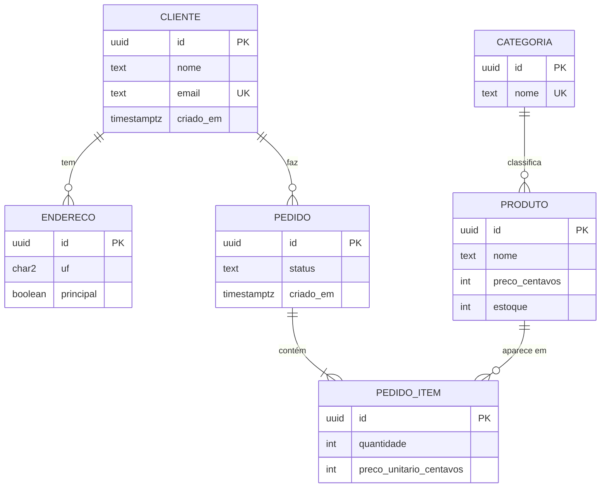

# cap12-ecommerce — modelo de dados de um e-commerce (PostgreSQL)

Schema completo de um e-commerce real — **clientes, endereços, produtos,
categorias, pedidos e itens** — com constraints, tipos corretos
(UUID/TIMESTAMPTZ/centavos), seed realista e 5 relatórios. Projeto do
capítulo 12 (PostgreSQL e SQL) do livro *Full Stack Moderno*.

## Diagrama entidade–relacionamento (DER)



Mesmo diagrama em ASCII (legível em qualquer terminal):

```
CLIENTE 1───N ENDERECO        CATEGORIA 1───N PRODUTO
CLIENTE 1───N PEDIDO
PEDIDO  1───N PEDIDO_ITEM N───1 PRODUTO
```

## Decisões de modelagem (o "porquê" de cada uma)

- **Preço em centavos (`INT`)**: nunca `FLOAT`/`NUMERIC` para dinheiro —
  somas exatas, sem erro de arredondamento;
- **`preco_unitario_centavos` no item é snapshot**: congela o preço da compra
  mesmo se o catálogo mudar (faturamento histórico correto);
- **`pedido_total` como VIEW**: o total do pedido deriva dos itens — sempre
  consistente, sem campo redundante sujeito a divergência;
- **`CHECK` em tudo**: status em lista fechada, `UF` de 2 letras, `CEP`
  com máscara, `quantidade > 0`, `estoque >= 0`;
- **`TIMESTAMPTZ`**: horário com fuso; `ON DELETE RESTRICT` protege
  catálogo/histórico; `CASCADE` apenas em endereço (pertence ao cliente).

## Como rodar (Docker + psql)

```bash
docker compose up -d          # PostgreSQL 18 em localhost:5432
export PGPASSWORD=ecommerce
psql -h localhost -U ecommerce -d ecommerce -f schema.sql
psql -h localhost -U ecommerce -d ecommerce -f seed.sql
psql -h localhost -U ecommerce -d ecommerce -f relatorios.sql
psql -h localhost -U ecommerce -d ecommerce -f desafios.sql   # opcional
```

## Seed

- **5 clientes** com endereço, **15 produtos** em **5 categorias**
  (Eletrônicos, Livros, Casa e Cozinha, Esporte, Beleza) e **20 pedidos**
  espalhados por 8 meses, com 1–3 itens cada.

## Os 5 relatórios (e o que o `EXPLAIN ANALYZE` mostra)

| # | Relatório | Consulta | Índice usado |
|---|-----------|----------|--------------|
| 1 | Faturamento por mês | `date_trunc` + `GROUP BY` | `idx_pedido_criado_em` (Index Only Scan) |
| 2 | Ticket médio | `AVG` + `PERCENTILE_CONT(0.5)` (mediana) | seq scan pequeno (view) |
| 3 | Top produtos | `GROUP BY produto` + `ORDER BY receita` | `idx_pedido_item_produto` |
| 4 | Clientes inativos (90 dias) | `LEFT JOIN` + `HAVING MAX(criado_em)` | `idx_pedido_cliente` |
| 5 | Estoque baixo (≤ 5) | filtro `estoque <= 5` + join categoria | `idx_produto_categoria` |

Rode cada bloco com `EXPLAIN ANALYZE` e confirme o plano (Index Scan em vez
de Seq Scan) — é o exercício de performance do capítulo. O exemplo real fica
documentado no próprio `relatorios.sql`.

## Desafios incluídos (`desafios.sql`)

- **Trigger** que decrementa o estoque ao inserir item (com guarda de estoque
  negativo — o exercício sênior discute a race condition e o `FOR UPDATE`);
- **Full-text em português**: coluna `tsvector` gerada + índice GIN +
  `plainto_tsquery` (busca "clean" acha "Clean Code" via stemming);
- **Window function**: faturamento acumulado mês a mês com `SUM() OVER`.

## Critérios de aceite (cap. 12)

| Critério | Onde |
|----------|------|
| DER documentado antes do código | README (Mermaid + ASCII) |
| Schema com 6+ tabelas, FKs e constraints | `schema.sql` (6 tabelas) |
| Tipos corretos: UUID, TIMESTAMPTZ, centavos | `schema.sql` |
| Seed realista (5 clientes, 15 produtos, 20 pedidos) | `seed.sql` |
| 5 consultas de relatório | `relatorios.sql` |
| `EXPLAIN ANALYZE` documentado com índice | `relatorios.sql` |
